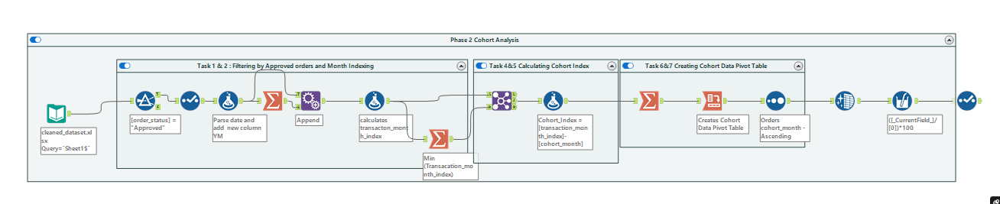
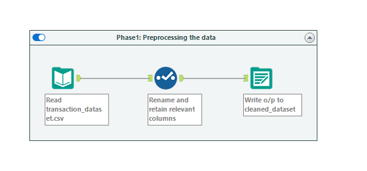
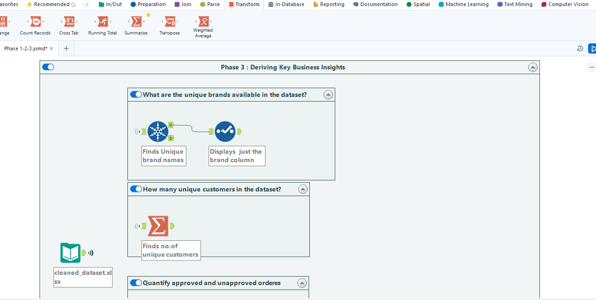
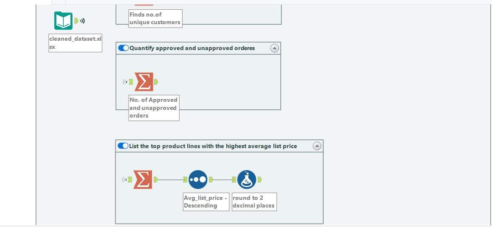
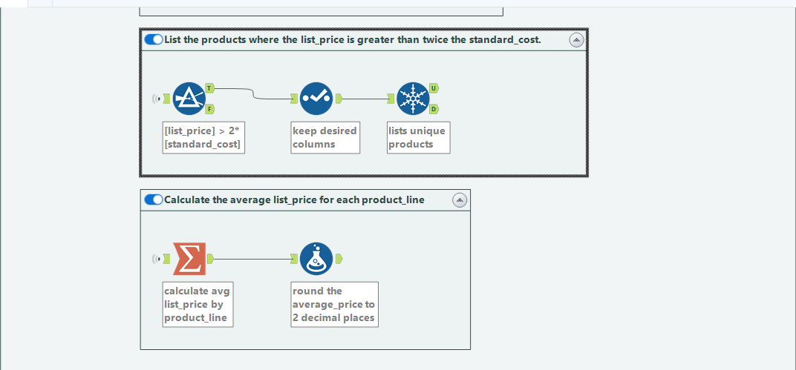
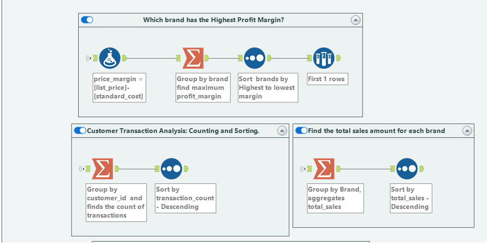
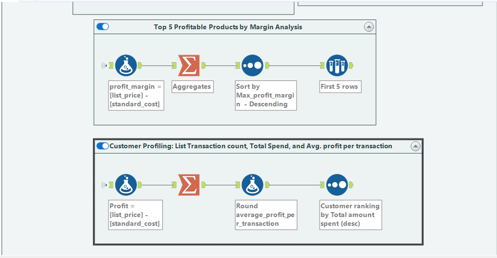
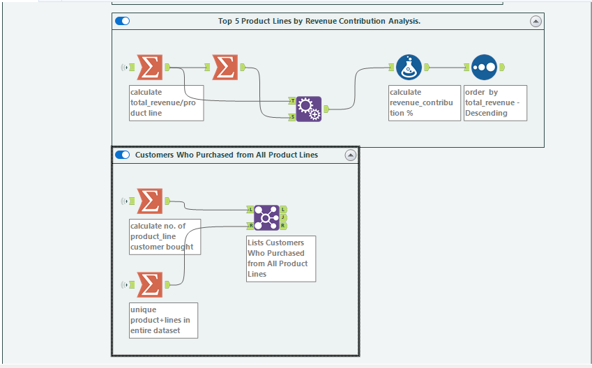

# Project Genesis

- This initiative demonstrates my two essential competencies:
  - Accelerated Learning: Showcases my capacity to quickly acquire proficiency in new technologies, a valuable asset for any organization.
  - Real-world Implementation: Validates my ability to effectively utilize these competencies for addressing business problems and knowledge transfer, as demonstrated through the detailed documentation available in this GitHub repository.

# Project Summary

Explore an educational expedition through my Alteryx initiative, crafted to optimize e-commerce workflows. This undertaking consists of three essential phases: Data Preparation, Cohort Evaluation, and Intelligence Development. Together, we'll decode the complexities of digital commerce, enabling informed decisions to enhance profitability.

Some of the workflow screenshots are shown below

      

# Table of Contents

1. Dataset: `transaction_dataset.csv`
2. Data Preparation
3. Cohort Evaluation
4. Intelligence Development
5. Project Motivation
6. Approach
7. Future Enhancements

# 1. Dataset{#dataset}

- [Download Dataset](https://github.com/SQLicious/Alteryx-Project-Ecommerce-Transaction-Cohort-Analysis/blob/main/1.%20Inputs/transaction_dataset.csv)

This initiative employs the `transaction_dataset.csv` dataset, containing comprehensive details about customer purchases, encompassing transaction identifiers, product information, customer identifiers, timestamps, and order statuses, along with additional attributes. The dataset originates from Hicounsellor.com/projects under the title *"Analyzing E-commerce Transactions"*. This CSV file comprises **20,000 records** spanning 13 columns.

## Data Structure

The dataset encompasses the following essential elements:

- Transaction ID
- Product ID
- Customer ID
- Transaction Date
- Online Order (True/False)
- Order Status (Approved/Unapproved)
- Brand
- Product_Line
- List Price
- Standard Cost
- Product First Sold Date

# Phases

This Alteryx workflow executes thorough analysis of customer transactions utilizing the supplied dataset. The initiative covers three primary phases:
1. Data Preparation
2. Cohort Evaluation
3. Business Intelligence Development

## 2. Phase 1- Data Preparation {#data-cleanup}

During this phase, the following activities were executed:
1. **Removed unnecessary columns:** Located and removed superfluous columns not required for analysis including "product_class" and "product_size" utilizing SELECT tool
2. **Data Type Adjustment:** Verified data types were suitable for analysis using SELECT tool
3. **Column Renaming:** Modified column names to improve readability using SELECT tool
4. **Quality Control:** Validated data accuracy using temporary BROWSE tool

## 3. Phase 2 - Cohort Evaluation {#cohort-analysis}

This phase encompassed the following activities:
1. **Customer Categorization:** Organized customers into cohorts according to their transaction patterns.
2. **Cohort Measurements:** Computed essential metrics (e.g., retention percentage, average expenditure) for each cohort.
3. **Tabular Display:** Produced Cohort Retention rates to facilitate cohort comparisons.

For a comprehensive view of the Cohort Evaluation workflow, reference the [Alteryx Workflow (.yxmd)](https://github.com/SQLicious/Alteryx-Project-Ecommerce-Transaction-Cohort-Analysis/blob/main/3.%20Workflows/Phase%201-2-3.yxmd)
...

## 4. Phase 3 Intelligence Development {#insights-generation}
The concluding phase involved constructing workflows to extract the following:
1. **Unique Brands**: Determined distinct brands present in the dataset.
2. **Individual Customers**: Calculated the count of unique customers who completed transactions.
3. **Approved vs. Rejected Orders**: Measured approved and rejected transactions.
4. **Mean List Price by Product Category**: Listed leading product categories with the highest average list price.
5. **Top 5 Most Profitable Products**: Determined products with the greatest profit margins.
6. **Customer Expenditure Analysis**: Assessed customer transactions, including total expenditure and average profit per transaction.
7. **Top 5 Product Categories by Revenue Generation**: Determined product categories with the highest total revenue generation.
8. **Customers Who Bought from All Product Categories**: Determined customers with purchases across all product categories.
9. **Total Sales Revenue by Brand**: Computed the total sales revenue for each brand.
10. **Top 5 Products with Greatest Profit Margins**: Determined the top 5 products with the highest profit margins.
11. **Customer Transaction Statistics**: Computed three statistics for each customer: Total transaction count, Total expenditure amount, Average profit per transaction
12. **Leading Product Categories by Revenue Share**: Determined product categories contributing the highest revenue percentage.
13. **Customers with Complete Product Range Engagement**: Determined customers who conducted transactions across all distinct product categories.

For a comprehensive view of the Business Intelligence Development workflow, reference the [Alteryx Workflow (.yxmd)](https://github.com/SQLicious/Alteryx-Project-Ecommerce-Transaction-Cohort-Analysis/blob/main/3.%20Workflows/Phase%201-2-3.yxmd).

## 5. Project Motivation {#project-inspiration}

This initiative takes inspiration from Hicounsellor's 'Analyzing E-commerce Transactions: Data Cleaning, Cohort Analysis, and SQL' which suggests a Python+SQL methodology. Nevertheless, I've adopted a distinctive strategy by exclusively employing Alteryx Designer. This demonstrates the effectiveness of low-code platforms like Alteryx Designer, providing an innovative viewpoint on optimizing workflows and extracting meaningful insights, even for non-technical business professionals.

## 6. Approach {#methodology}
In this initiative, I applied the expertise and understanding gained through the Alteryx Designer Core certification and the completion of four microcredentials. This enabled me to utilize a comprehensive collection of Alteryx tools, implementing them within a unified workflow.

Throughout this initiative, I maximized Alteryx's capabilities, seamlessly implementing all phases. Utilized an extensive array of powerful tools from each tool category:
- **In/Out Tools:**
  - Input
  - Output

- **Preparation Tools:**
  - Data Cleansing
  - Filter
  - Formula
  - Multi-Field
  - Sample
  - Select
  - Sort
  - Unique

- **Join Tools:**
  - Append
  - Join

- **Transform Tools:**
  - Cross-Tab
  - Summarise

I maintained an optimal data transformation workflow. This would have required 3 weeks (120 man hours using the SQL and Python methodology) and I developed this workflow in **just 3 days**.
This extensive utilization of Alteryx demonstrates its exceptional capabilities in ETL (Extract - Load - Transformation).

## 7. Future Enhancements {#upcoming-additions}

I intend to automate the creation of a comprehensive PDF report merging Phase 2 cohort evaluation results with responses to 13 business questions. This report will be automatically distributed to a specified recipient list. Furthermore, I'm investigating the potential for exporting Phase 2 cohort evaluation data to Tableau using the Tableau output tool.

**Project Created By: [Bhumi Limbachiya]**
**Date: [02-10-2024]**